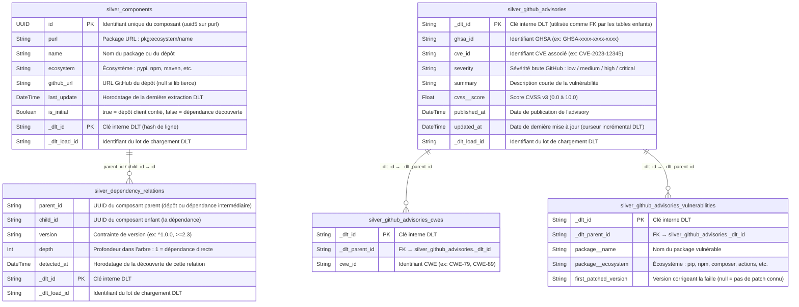
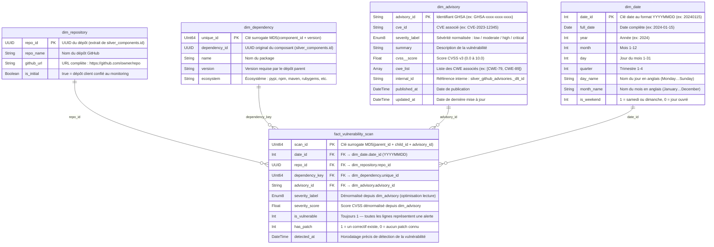

# Schémas MCD — Couches Silver et Gold

## Architecture globale des données

```
GitHub API (GraphQL + REST)
        │
        ▼
   [DLT Pipelines]
        │
        ▼
  Bronze (S3/MinIO)
  JSONL/Parquet bruts
        │
        ▼ S3Queue ClickHouse
  ┌─────────────────────┐
  │   SILVER (ClickHouse) │  ← données brutes structurées
  └─────────────────────┘
        │
        ▼ dbt transformations
  ┌─────────────────────┐
  │   GOLD (ClickHouse)  │  ← star schema analytique
  └─────────────────────┘
```

---

## Couche Silver — MCD (Modèle Conceptuel de Données)



---

## Couche Gold — MCD Star Schema



---

## Flux de transformation Silver → Gold

```
silver_components ──────────────────────────────────┐
silver_dependency_relations ─────────────────────────┼──► dim_repository
                                                     │    (nœuds racine : parent sans parent)
silver_components ──────────────────────────────────┐│
silver_dependency_relations ─────────────────────────┼┴──► dim_dependency
                                                     │     (composant × version unique)
silver_github_advisories ────────────────────────────┐
silver_github_advisories_cwes ───────────────────────┼──► dim_advisory
                                                     │    (normalisation sévérité, agrégation CWE)
[généré] 2024-01-01 + 1500 jours ────────────────────────► dim_date

dim_dependency ──────────────────────────────────────┐
silver_dependency_relations ─────────────────────────┤
silver_github_advisories_vulnerabilities ────────────┼──► fact_vulnerability_scan
dim_advisory ────────────────────────────────────────┘
```
